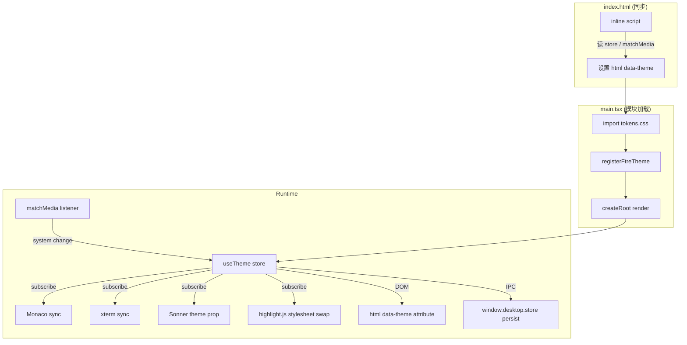
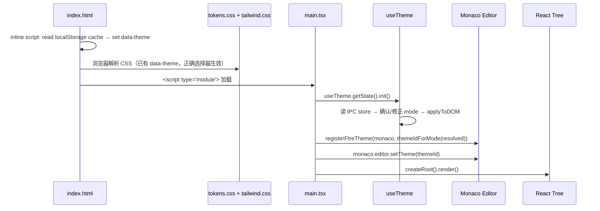

# 设计文档：主题模式切换 + Token 统一

## Overview

本设计实现 `ftre-desktop` 渲染端的三态主题模式切换（`light` / `dark` / `system`）与语义化 CSS Token 统一。核心目标：

1. **单一来源 Token 层**：在 `packages/renderer/src/styles/tokens.css` 中定义全部语义化颜色变量，通过 `html[data-theme="light"]` / `html[data-theme="dark"]` 选择器提供双值。
2. **Theme Manager**：一个 Zustand store（`useTheme`），负责模式状态管理、DOM 标记、持久化、系统偏好监听、以及向 Monaco / xterm / Sonner / highlight.js 广播变更。
3. **首屏无闪烁**：在 `index.html` 的 `<head>` 中注入同步内联脚本，在任何 CSS/JS 加载前确定 `data-theme` 属性。
4. **向后兼容**：暗色模式下所有 Token 值与现有硬编码颜色字节级相等；旧变量名以别名形式保留并标注弃用。
5. **颜色字面量禁止**：提供 Node.js lint 脚本 + allowlist 文件，可在 CI 中运行。

## Architecture



**关键设计决策：**

| 决策 | 选择 | 理由 |
|------|------|------|
| Token 切换机制 | `html[data-theme]` CSS 选择器 | 纯 CSS 驱动，无需 JS 逐个更新变量；与 Tailwind v4 `@theme` 兼容 |
| 状态管理 | Zustand store | 项目已大量使用 Zustand；支持 React 外订阅（Monaco/xterm） |
| 首屏防闪 | `<head>` 内联同步脚本 | 在 CSSOM 构建前设置属性，避免 FOUC |
| Monaco 明色主题 | 基于 VS Code Light+ 自建 `ftre-light` | 与暗色 `darcula`/`ftre-neon` 对称；编辑器背景从 Token 读取 |
| highlight.js 切换 | 动态 `<link>` 替换 | 避免两套样式同时加载冲突 |

## Components and Interfaces

### 1. Token 文件：`packages/renderer/src/styles/tokens.css`

```css
/**
 * FTRE Design Token — 唯一颜色来源
 *
 * 命名约定：--ftre-{category}-{role}
 * 类别：bg, border, text, accent, status, selection, scrollbar
 * 示例：--ftre-bg-base, --ftre-text-primary, --ftre-accent-default
 *
 * ⚠️ 仅此文件允许出现 Color Literal。
 */

/* ===== Dark Mode (默认 / 基线) ===== */
html[data-theme="dark"] {
  /* 背景 */
  --ftre-bg-base: #1a1b1d;
  --ftre-bg-surface: #1a1b1d;
  --ftre-bg-elevated: #252526;
  --ftre-bg-panel: #2d2d2d;
  --ftre-bg-menu: #252526;

  /* 边框 */
  --ftre-border-default: #3c3c3c;
  --ftre-border-subtle: #454545;

  /* 文字 */
  --ftre-text-primary: #e8e8e8;
  --ftre-text-secondary: #cccccc;
  --ftre-text-muted: #aab0b8;
  --ftre-text-dim: #969ca6;
  --ftre-text-ghost: #888e98;
  --ftre-text-faint: #7a8088;

  /* 强调色 */
  --ftre-accent-default: #00ff88;
  --ftre-accent-hover: #00cc6e;
  --ftre-accent-dim: rgba(0, 255, 136, 0.12);
  --ftre-accent-ghost: rgba(0, 255, 136, 0.06);

  /* 状态 */
  --ftre-status-success: #00ff88;
  --ftre-status-warning: #d29922;
  --ftre-status-error: #f85149;
  --ftre-status-danger: #f85149;
  --ftre-status-info: #58a6ff;

  /* 选区 */
  --ftre-selection-bg: rgba(0, 255, 136, 0.15);
  --ftre-selection-fg: #ffffff;

  /* 滚动条 */
  --ftre-scrollbar-thumb: #454545;
  --ftre-scrollbar-thumb-hover: rgba(0, 255, 136, 0.3);
  --ftre-scrollbar-track: transparent;
}

/* ===== Light Mode ===== */
html[data-theme="light"] {
  /* 背景 */
  --ftre-bg-base: #ffffff;
  --ftre-bg-surface: #f8f9fa;
  --ftre-bg-elevated: #ffffff;
  --ftre-bg-panel: #f0f1f3;
  --ftre-bg-menu: #ffffff;

  /* 边框 */
  --ftre-border-default: #d4d4d8;
  --ftre-border-subtle: #e4e4e7;

  /* 文字 */
  --ftre-text-primary: #1a1a1a;
  --ftre-text-secondary: #3f3f46;
  --ftre-text-muted: #52525b;
  --ftre-text-dim: #71717a;
  --ftre-text-ghost: #a1a1aa;
  --ftre-text-faint: #d4d4d8;

  /* 强调色 — 降低饱和度避免刺眼 */
  --ftre-accent-default: #059669;
  --ftre-accent-hover: #047857;
  --ftre-accent-dim: rgba(5, 150, 105, 0.10);
  --ftre-accent-ghost: rgba(5, 150, 105, 0.05);

  /* 状态 */
  --ftre-status-success: #059669;
  --ftre-status-warning: #d97706;
  --ftre-status-error: #dc2626;
  --ftre-status-danger: #dc2626;
  --ftre-status-info: #2563eb;

  /* 选区 */
  --ftre-selection-bg: rgba(5, 150, 105, 0.15);
  --ftre-selection-fg: #1a1a1a;

  /* 滚动条 */
  --ftre-scrollbar-thumb: #c4c4c8;
  --ftre-scrollbar-thumb-hover: rgba(5, 150, 105, 0.4);
  --ftre-scrollbar-track: transparent;
}
```

### 2. Theme Manager Store：`packages/renderer/src/stores/theme.ts`

```typescript
import { create } from 'zustand';

export type ThemeMode = 'light' | 'dark' | 'system';
export type ResolvedMode = 'light' | 'dark';

const VALID_MODES: Set<string> = new Set(['light', 'dark', 'system']);
const STORAGE_KEY = 'ftre-theme-mode';

export interface ThemeState {
  mode: ThemeMode;
  resolvedMode: ResolvedMode;
  setMode: (mode: ThemeMode) => void;
  /** 内部：系统偏好变化时调用 */
  _onSystemChange: (prefersDark: boolean) => void;
  /** 初始化（在 React 渲染前调用） */
  init: () => Promise<void>;
}

function resolveMode(mode: ThemeMode, prefersDark: boolean): ResolvedMode {
  if (mode === 'light') return 'light';
  if (mode === 'dark') return 'dark';
  return prefersDark ? 'dark' : 'light';
}

function getSystemPrefersDark(): boolean {
  return window.matchMedia('(prefers-color-scheme: dark)').matches;
}

function applyToDOM(resolved: ResolvedMode): void {
  document.documentElement.setAttribute('data-theme', resolved);
}

export const useTheme = create<ThemeState>((set, get) => ({
  mode: 'system',
  resolvedMode: getSystemPrefersDark() ? 'dark' : 'light',

  setMode: (newMode) => {
    if (!VALID_MODES.has(newMode)) {
      console.warn(`[ThemeManager] Invalid mode "${newMode}", falling back to "system"`);
      newMode = 'system';
    }
    const resolved = resolveMode(newMode, getSystemPrefersDark());
    applyToDOM(resolved);
    set({ mode: newMode, resolvedMode: resolved });
    // 持久化
    window.desktop?.store?.set(STORAGE_KEY, newMode).catch(() => {});
  },

  _onSystemChange: (prefersDark) => {
    const { mode } = get();
    if (mode !== 'system') return;
    const resolved = prefersDark ? 'dark' : 'light';
    applyToDOM(resolved);
    set({ resolvedMode: resolved });
  },

  init: async () => {
    let persisted: string | null = null;
    try {
      if (window.desktop?.store) {
        const { value } = await window.desktop.store.get(STORAGE_KEY);
        if (typeof value === 'string') persisted = value;
      }
    } catch {
      // IPC 失败，静默回退
    }

    let mode: ThemeMode = 'system';
    if (persisted && VALID_MODES.has(persisted)) {
      mode = persisted as ThemeMode;
    } else if (persisted) {
      console.warn(`[ThemeManager] Invalid persisted mode "${persisted}", falling back to "system"`);
    }

    const resolved = resolveMode(mode, getSystemPrefersDark());
    applyToDOM(resolved);
    set({ mode, resolvedMode: resolved });

    // 监听系统偏好变化
    const mql = window.matchMedia('(prefers-color-scheme: dark)');
    mql.addEventListener('change', (e) => {
      get()._onSystemChange(e.matches);
    });
  },
}));
```

### 3. 首屏防闪脚本：`index.html` `<head>` 内联

```html
<script>
  // 同步读取持久化模式，在 CSS 加载前设置 data-theme
  // 注意：window.desktop 在 preload 中注入，此时已可用
  (function() {
    var mode = 'system';
    try {
      // Electron preload 同步暴露的 store 接口
      // 如果 preload 未提供同步读取，则回退到 localStorage 缓存
      var cached = localStorage.getItem('ftre-theme-mode-cache');
      if (cached === 'light' || cached === 'dark' || cached === 'system') {
        mode = cached;
      }
    } catch(e) {}
    var resolved = mode;
    if (mode === 'system') {
      resolved = window.matchMedia('(prefers-color-scheme: dark)').matches ? 'dark' : 'light';
    }
    document.documentElement.setAttribute('data-theme', resolved);
    // 设置初始背景防止白闪
    document.documentElement.style.backgroundColor = resolved === 'dark' ? '#1a1b1d' : '#ffffff';
  })();
</script>
```

**双重缓存策略**：`useTheme.setMode()` 在写入 `window.desktop.store`（异步 IPC）的同时，同步写入 `localStorage` 的 `ftre-theme-mode-cache` 键。`index.html` 内联脚本从 `localStorage` 同步读取，确保首帧正确。

### 4. Tailwind v4 `@theme` 重构

重构后的 `tailwind.css` `@theme` 块不再包含颜色字面量，改为引用 Token：

```css
@theme {
  --color-base: var(--ftre-bg-base);
  --color-surface: var(--ftre-bg-surface);
  --color-elevated: var(--ftre-bg-elevated);
  --color-panel: var(--ftre-bg-panel);
  --color-border: var(--ftre-border-default);
  --color-border-subtle: var(--ftre-border-subtle);
  --color-neon: var(--ftre-accent-default);
  --color-neon-dim: var(--ftre-accent-dim);
  --color-neon-ghost: var(--ftre-accent-ghost);
  --color-t-primary: var(--ftre-text-primary);
  --color-t-secondary: var(--ftre-text-secondary);
  --color-t-muted: var(--ftre-text-muted);
  --color-t-dim: var(--ftre-text-dim);
  --color-t-ghost: var(--ftre-text-ghost);
  --color-t-faint: var(--ftre-text-faint);
  --color-danger: var(--ftre-status-danger);
  --color-warning: var(--ftre-status-warning);
  --color-info: var(--ftre-status-info);
  /* 字体保持不变 */
  --font-mono: "JetBrains Mono", "Cascadia Code", "Fira Code", "Consolas", monospace;
  --font-sans: "Inter", -apple-system, "Segoe UI", sans-serif;
}
```

### 5. 向后兼容别名

在 `tokens.css` 末尾追加别名块：

```css
/* ===== 向后兼容别名 (DEPRECATED — 将在 v0.3.0 移除) ===== */
:root {
  /* @deprecated 使用 --ftre-bg-base */
  --bg-base: var(--ftre-bg-base);
  --bg-surface: var(--ftre-bg-surface);
  --bg-elevated: var(--ftre-bg-elevated);
  --bg-hover: var(--ftre-bg-panel);
  --bg-active: var(--ftre-bg-panel);

  --text-primary: var(--ftre-text-primary);
  --text-secondary: var(--ftre-text-secondary);
  --text-muted: var(--ftre-text-muted);

  --accent: var(--ftre-accent-default);
  --accent-hover: var(--ftre-accent-hover);
  --accent-muted: var(--ftre-accent-dim);

  --ftre-accent: var(--ftre-accent-default);
  --ftre-accent-dim: var(--ftre-accent-dim);

  --success: var(--ftre-status-success);
  --warning: var(--ftre-status-warning);
  --error: var(--ftre-status-error);
  --info: var(--ftre-status-info);

  /* @ftre/ui 兼容 */
  --ftre-base: var(--ftre-bg-base);
  --ftre-surface: var(--ftre-bg-surface);
  --ftre-elevated: var(--ftre-bg-elevated);
  --ftre-panel: var(--ftre-bg-panel);
  --ftre-menu-bg: var(--ftre-bg-menu);
  --ftre-border: var(--ftre-border-default);
  --ftre-border-subtle: var(--ftre-border-subtle);
  --ftre-text-primary: var(--ftre-text-primary);
  --ftre-text-secondary: var(--ftre-text-secondary);
  --ftre-text-muted: var(--ftre-text-muted);
  --ftre-text-dim: var(--ftre-text-dim);
  --ftre-text-ghost: var(--ftre-text-ghost);
  --ftre-text-faint: var(--ftre-text-faint);
  --ftre-accent-hover: var(--ftre-accent-hover);
  --ftre-accent-ghost: var(--ftre-accent-ghost);
  --ftre-danger: var(--ftre-status-danger);
  --ftre-error: var(--ftre-status-error);
  --ftre-warning: var(--ftre-status-warning);
  --ftre-info: var(--ftre-status-info);
  --ftre-success: var(--ftre-status-success);

  /* 间距/字体/圆角保持不变 */
  --gap-xs: 4px;
  --gap-sm: 8px;
  --gap-md: 12px;
  --gap-lg: 16px;
  --gap-xl: 24px;
  --font-mono: "JetBrains Mono", "Cascadia Code", "Fira Code", "Consolas", monospace;
  --font-sans: "Inter", -apple-system, "Segoe UI", sans-serif;
  --font-size-xs: 11px;
  --font-size-sm: 12px;
  --font-size-md: 13px;
  --font-size-lg: 14px;
  --radius-sm: 4px;
  --radius-md: 6px;
  --titlebar-height: 40px;
  --color-base: var(--ftre-bg-base);
}
```

### 6. Monaco 明暗主题配对

**新增文件**：`packages/editor/src/ui/themes/ftre-light.ts`

基于 VS Code Light+ 色板构建，`base: 'vs'`，`editor.background` 从 CSS 变量 `--ftre-bg-base` 读取（与暗色主题策略一致）。

**`theme-registry.ts` 改造**：

```typescript
// 新增：支持按 resolved mode 获取对应主题 id
export function getThemeIdForMode(resolved: 'light' | 'dark'): string {
  return resolved === 'light' ? 'ftre-light' : 'darcula';
}

// registerFtreTheme 改造：接受 themeId 参数，短路逻辑不变
export function registerFtreTheme(monaco: typeof Monaco, themeId?: string): void {
  const theme = getTheme(themeId);
  if (registeredThemeId === theme.id) return;
  // ... 现有逻辑
}
```

**`themes/index.ts` 改造**：注册 `ftre-light` 到 `builtinThemes`，`base` 字段标记为 `'vs'`。

### 7. xterm 主题工厂

**新增函数**：`packages/renderer/src/services/terminal/terminal-theme.ts`

```typescript
import type { ITheme } from '@xterm/xterm';

export function getTerminalTheme(resolved: 'light' | 'dark'): ITheme {
  const style = getComputedStyle(document.documentElement);
  const v = (name: string) => style.getPropertyValue(name).trim();

  return {
    background: v('--ftre-bg-base'),
    foreground: v('--ftre-text-primary'),
    cursor: v('--ftre-accent-default'),
    selectionBackground: v('--ftre-selection-bg'),
    // ANSI 颜色从 Token 扩展或保持 dark/light 预设
    ...getAnsiColors(resolved),
  };
}
```

ANSI 16 色在 `tokens.css` 中额外定义（`--ftre-ansi-black` 等），或在工厂函数中按 resolved mode 返回预设映射表。考虑到 ANSI 色与语义 Token 关系较弱，采用工厂内预设映射表方案，避免 Token 文件过于膨胀。

### 8. Sonner / highlight.js / Markdown 切换

| 子系统 | 切换方式 |
|--------|----------|
| Sonner `<Toaster>` | `theme` prop 绑定 `useTheme(s => s.resolvedMode)` |
| highlight.js | 动态创建/替换 `<link id="hljs-theme">` 元素，`href` 指向 `github-dark.min.css` 或 `github.min.css` |
| Markdown (`markdown.css`) | 已使用 `var(--text-primary)` 等旧别名，别名指向 Token 后自动跟随 |
| 滚动条 / `::selection` | `reset.css` 改用 `var(--ftre-scrollbar-*)` / `var(--ftre-selection-*)` |
| `global.css` Sonner 覆盖 | 颜色值替换为 `var(--ftre-*)` Token |

**highlight.js 切换实现**：

```typescript
// packages/renderer/src/lib/hljs-theme-loader.ts
const LINK_ID = 'hljs-theme-link';

export function setHljsTheme(resolved: 'light' | 'dark'): void {
  const href = resolved === 'dark'
    ? '/node_modules/highlight.js/styles/github-dark.min.css'
    : '/node_modules/highlight.js/styles/github.min.css';

  let link = document.getElementById(LINK_ID) as HTMLLinkElement | null;
  if (!link) {
    link = document.createElement('link');
    link.id = LINK_ID;
    link.rel = 'stylesheet';
    document.head.appendChild(link);
  }
  link.href = href;
}
```

在 `main.tsx` 中移除静态 `import "highlight.js/styles/github-dark.min.css"`，改为在 `useTheme.init()` 后调用 `setHljsTheme(resolvedMode)`，并在 store subscribe 中响应后续变更。

### 9. 持久化策略

| 层 | 键名 | 用途 |
|----|------|------|
| `window.desktop.store` (Electron IPC) | `ftre-theme-mode` | 主持久化，跨窗口一致 |
| `localStorage` | `ftre-theme-mode-cache` | 首屏防闪同步读取的镜像缓存 |

**读取优先级**：`init()` 时先尝试 `window.desktop.store.get`（异步），若失败则回退 `localStorage` 缓存，若均无则默认 `system`。

**写入**：`setMode()` 同时写入两处。

### 10. 首屏初始化时序



### 11. UI 模式切换入口

在 `ActivityBar` 底部区域添加一个图标按钮（使用 `lucide-react` 的 `Sun` / `Moon` / `Monitor` 图标），点击后弹出一个小型下拉菜单（使用 `@radix-ui/react-dropdown-menu`），列出三个选项：

- ☀️ 浅色模式 (`light`)
- 🌙 深色模式 (`dark`)
- 💻 跟随系统 (`system`)

当前激活项带勾选标记。按钮图标根据 `resolvedMode` 动态切换（`light` → Sun，`dark` → Moon），tooltip 显示当前状态（如 "主题：跟随系统 (当前深色)"）。

### 12. 颜色字面量 Lint 脚本

**文件**：`scripts/lint-color-literals.mjs`

```javascript
// Node.js ESM 脚本
// 扫描 packages/renderer/src/** 与 packages/ui/src/**
// 排除 tokens.css 与 allowlist 中的文件
// 匹配正则：/#[0-9a-fA-F]{3,8}\b/, /rgba?\(/, /hsla?\(/, /oklch\(/, /color\(/
// 输出违规文件路径与行号，非零退出码
```

**Allowlist 文件**：`scripts/color-literal-allowlist.json`

```json
[
  "packages/editor/src/ui/themes/darcula.ts",
  "packages/editor/src/ui/themes/ftre-neon.ts",
  "packages/editor/src/ui/themes/ftre-light.ts",
  "packages/renderer/src/styles/tokens.css"
]
```

Monaco 主题文件中的 token foreground 颜色是 Monaco API 要求的字面量格式，属于合理豁免。

## Data Models

### ThemeState (Zustand Store)

```typescript
interface ThemeState {
  /** 用户选择的模式 */
  mode: ThemeMode;           // 'light' | 'dark' | 'system'
  /** 解析后的实际模式 */
  resolvedMode: ResolvedMode; // 'light' | 'dark'
  /** 设置模式（触发 DOM 更新 + 持久化 + 广播） */
  setMode: (mode: ThemeMode) => void;
  /** 系统偏好变化回调 */
  _onSystemChange: (prefersDark: boolean) => void;
  /** 异步初始化 */
  init: () => Promise<void>;
}
```

### Token 命名规范

| 前缀 | 语义 | 示例 |
|------|------|------|
| `--ftre-bg-` | 背景色 | `--ftre-bg-base`, `--ftre-bg-surface` |
| `--ftre-border-` | 边框色 | `--ftre-border-default`, `--ftre-border-subtle` |
| `--ftre-text-` | 文字色 | `--ftre-text-primary`, `--ftre-text-muted` |
| `--ftre-accent-` | 强调色 | `--ftre-accent-default`, `--ftre-accent-hover` |
| `--ftre-status-` | 状态色 | `--ftre-status-error`, `--ftre-status-info` |
| `--ftre-selection-` | 选区 | `--ftre-selection-bg`, `--ftre-selection-fg` |
| `--ftre-scrollbar-` | 滚动条 | `--ftre-scrollbar-thumb` |

### FtreThemeDefinition 扩展

```typescript
interface FtreThemeDefinition {
  id: string;
  label: string;
  base: editor.BuiltinTheme; // 'vs' | 'vs-dark' | 'hc-black'
  inherit: boolean;
  tokenRules: FtreThemeTokenRule[];
  editorColors: Record<string, string>;
  /** 新增：该主题适用的 resolved mode */
  mode: 'light' | 'dark';
}
```

### 持久化数据

| 存储 | 键 | 值类型 | 示例 |
|------|-----|--------|------|
| Electron Store | `ftre-theme-mode` | `string` | `"dark"` |
| localStorage | `ftre-theme-mode-cache` | `string` | `"dark"` |
