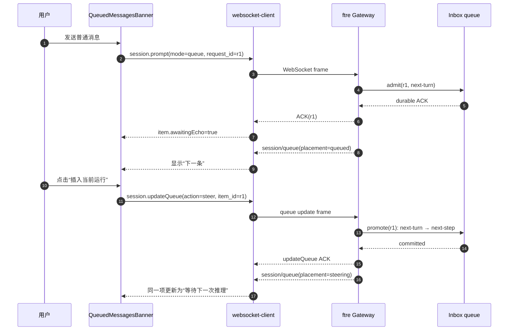
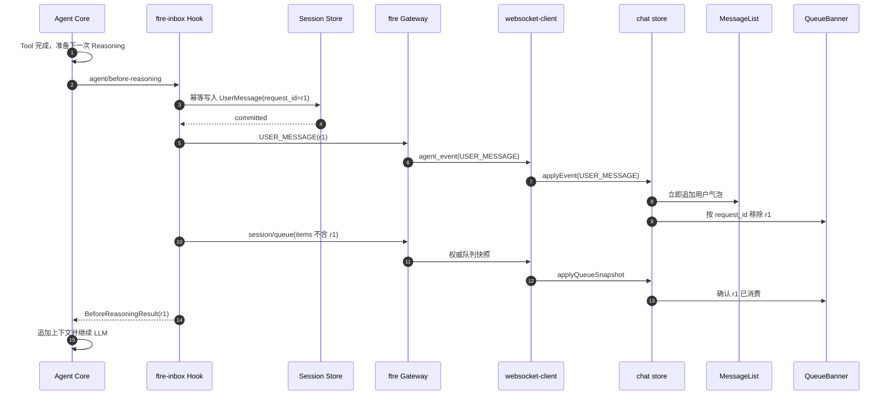

# PRD-B3 Runtime Steering 队列交互

## 元信息

| 字段 | 值 |
|---|---|
| 阶段 | B3 |
| 名称 | Runtime Steering 队列交互 |
| 状态 | 已验收 |
| 创建日期 | 2026-08-24 |
| 定稿日期 | 2026-08-24 |
| 验收日期 | 2026-08-24 |
| 关联文档 | `docs/TODO.yaml` 阶段 B3；`E:\\ftre\\docs\\prd\\PRD-F22-runtime-steering-message-injection.md`；`PRD-B1-ws-mailbox.md`；`AGENTS.md` |

## 1. 背景与目标

ftre 后端 F22 冻结了三种输入语义：普通消息进入 `queue`，用户可以将已排队消息升级为
`steer`，Agent 在下一次 `agent/before-reasoning` 前消费它。客户端已有
`session.updateQueue({kind:"steer"})` 协议类型和 `awaitingEcho` 保护，但没有真正的
Steering 按钮与完整状态投影。

本阶段目标：

```text
发送消息 → queued
点击“插入当前运行” → steering
Tool 完成 → 后端 USER_MESSAGE 持久化回显
             → MessageList 立即出现用户消息
             → session/queue 移除对应项
             → Agent 继续流式运行
```

客户端不自行执行队列、不猜测 Agent 状态、不生成第二个 request_id；服务端快照和
`USER_MESSAGE` 事件是唯一事实来源。

## 2. 非目标

- 不修改 ftre 后端 Inbox、Session 或 Agent 算法；后端改动由 F22 独立 PR 完成；
- 不修改 `E:\\ftre-agent-core` 或 `E:\\cordis-py`；
- 不在客户端中实现队列持久化、claim、Steering 消费或数据库写入；
- 不立即打断当前 LLM/Tool；Steering 只在下一次 Reasoning 边界生效；
- 不为 Steering 重新发送 content，不创建第二个用户气泡或第二个 request_id。

## 3. 功能需求

- [x] **FR1：普通消息先进入 queued**
  - `sendChat()` 默认仍发送 `mode: "queue"`；
  - 本地 optimistic 项只显示在队列横幅，不提前创建 MessageList 用户气泡；
  - durable ACK 后使用服务端 request_id 替换本地 id，进入 `awaitingEcho`。

- [x] **FR2：队列项升级为 Steering**
  - queued 项显示“插入当前运行”按钮；
  - 点击后调用 `updateQueue(sessionId, itemId, {kind:"steer"})`；
  - request_id 和 content 保持不变；
  - 操作期间按钮、编辑和删除操作禁用；
  - ACK 失败时保留 queued，显示错误并允许重试。

- [x] **FR3：权威 placement 投影**
  - `QueueItemView` 保存 `queued` / `steering` / `context` placement；
  - `session/queue` 到达后只按服务端 snapshot 更新 placement；
  - steering 项显示“等待下一次推理”，在 USER_MESSAGE 到达前不能从横幅消失；
  - 不通过本地 busy 状态推断 placement。

- [x] **FR4：USER_MESSAGE 与队列交接**
  - 收到 `USER_MESSAGE` 后，按 metadata.request_id 找到对应队列项；
  - 如果当前存在 streaming assistant，先封口当前 segment，再把正式 UserMessage 插入其后，
    后续同 reply_id Event 使用新的 assistant 尾段；
  - 再移除该 request_id 的 pending 横幅项；
  - 重复 USER_MESSAGE 按 event id/message id 去重；
  - queue snapshot 先到时保留 `awaitingEcho`，直到 USER_MESSAGE 到达。

- [x] **FR5：断线、重连和乱序保护**
  - Steering promote 控制帧进入 control outbox，断线后按同 request_id 重发；
  - attach snapshot 同时恢复 MessageList 和 session/queue；
  - 重连不得重新创建已 ACK 的 optimistic item；
  - queue、USER_MESSAGE、status 重复或乱序不得出现“消失→重新出现”的视觉空窗。

## 4. 交互时序

### 4.1 queue → steer



### 4.2 消费与 MessageList 交接



## 5. 客户端改动清单

| 文件 | 改动 |
|---|---|
| `packages/renderer/src/services/websocket-client.ts` | 增加 placement 字段；提供 promote Steering 的高层方法或复用 updateQueue；控制帧进入 outbox |
| `packages/renderer/src/features/chat/QueuedMessagesBanner.tsx` | queued 项增加按钮；steering 项显示等待状态；处理 loading、错误和重试 |
| `packages/renderer/src/stores/chat.ts` | 保留 queued→steering→awaitingEcho→MessageList 交接；切分 active reply segment；按 request_id 去重；保留现有乱序保护 |
| `packages/renderer/src/features/chat/QueuedMessagesBanner.test.tsx` | 按钮渲染、点击、loading、失败和重试 |
| `packages/renderer/src/stores/chat.test.ts` | placement、USER_MESSAGE 先到/queue 先到、重复和重连 |
| `packages/renderer/src/services/websocket-client.test.ts` | steer update frame、ACK、超时、断线重发 |

## 6. 验收标准

- [x] **AC1：普通消息进入 queued**
  - sendChat 发送 mode=queue；队列横幅显示消息；MessageList 暂不创建用户气泡。

- [x] **AC2：按钮升级成功**
  - 点击按钮发送 action=steer；同一 request_id 的服务端 placement 变为 steering；
  - 不新增消息、不重复发送 content。

- [x] **AC3：按钮失败可恢复**
  - ACK 错误时项目仍为 queued；按钮恢复可用；用户可以重试。

- [x] **AC4：消费无视觉空窗**
  - USER_MESSAGE 到达后用户气泡立即出现；对应队列项移除；Agent 流式输出不中断。
  - 用户气泡位于前半段 assistant 输出和后半段 assistant 输出之间，不被整轮回复拖到末尾。

- [x] **AC5：乱序与重连**
  - queue snapshot 先到、USER_MESSAGE 先到、重复事件和 WebSocket 重连均不重复、不丢失。

- [x] **AC6：质量门禁**
  - `pnpm test`、renderer/platform tsc 通过；后端 Gateway smoke 和跨仓 Steering E2E 通过。

## 7. 变更记录

| 日期 | 变更内容 | 理由 |
|---|---|---|
| 2026-08-24 | 创建 B3 客户端 PRD；冻结 queue→steer 按钮、placement 投影、USER_MESSAGE/队列无空窗交接和跨仓验收 | 配套 ftre F22 完成运行中 Steering 消息注入的客户端交互闭环 |
| 2026-08-24 | 完成 renderer placement、Steering 按钮、ACK/失败重试、active reply segment 切分和 USER_MESSAGE 无空窗交接；514 测试、TypeScript 与 Vite 构建通过 | B3 客户端交互闭环已实现 |
| 2026-08-24 | 后续 B4/C4/F23 用权威 message_id 替代客户端人工 segment；B3 的按钮、placement、ACK 和 outbox 语义继续保留 | 同 reply_id 的多条 AssistantMsg 应由 Core 明确建模，客户端只投影 A→User→B，不再重命名消息 |
