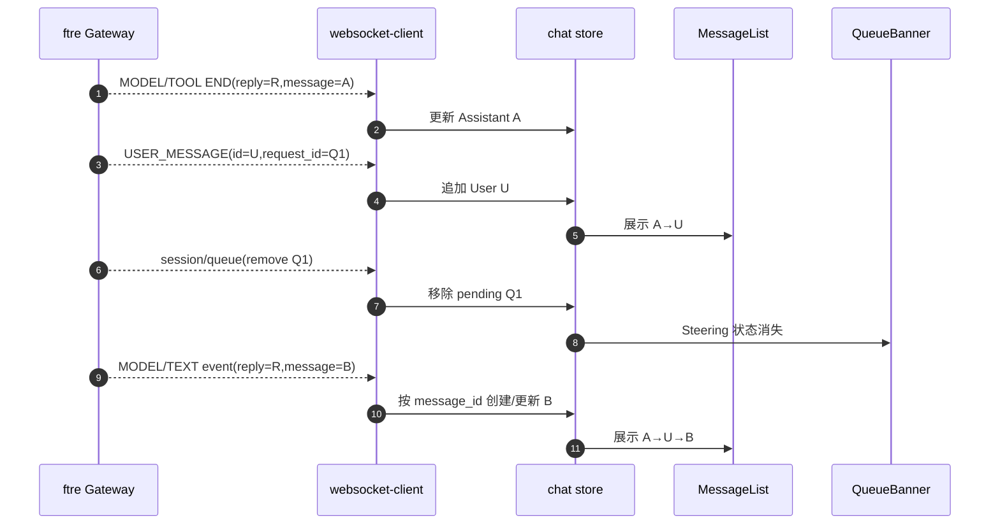

# PRD-B4 Steering 多 AssistantMessage 客户端投影

## 元信息

| 字段 | 值 |
|---|---|
| 阶段 | B4 |
| 名称 | 按 Core message_id 投影 A→User→B |
| 状态 | 已验收 |
| 创建日期 | 2026-08-24 |
| 定稿日期 | 2026-08-24 |
| 验收日期 | 2026-08-24 |
| 关联文档 | `docs/TODO.yaml` B4；`PRD-B3-runtime-steering.md`；`E:\ftre\docs\prd\PRD-F23-steering-message-boundary.md`；`E:\ftre-agent-core\docs\prd\PRD-C4-user-message-assistant-boundary.md`；`AGENTS.md` |

> 协议更新：B4 的 `message_id` 投影和 Queue/User 乱序语义仍是当前契约；队列操作成功
> 响应已由后续 B5 改为带 `revision/items` 的 `session/queue` Queue Operation Response，
> 旧 admission ACK 仅保留在历史上下文中，不得重新实现。

## 1. 背景与目标

B3 为解决同一 `reply_id` 下 Steering UserMessage 被拖到整轮末尾的问题，在客户端收到
`USER_MESSAGE` 时主动封口当前 Assistant，并为后续同 reply_id Event 推断新 segment。
该方案与 ftre SessionProjection 重复实现同一边界，并依赖
`reply_id:segment:<event_id>` 的隐式 id 规则。

Core C4 和 ftre F23 将让每条 AssistantMsg 拥有唯一 `message_id`，同时保留稳定
`reply_id` 关联整次 Agent 运行。客户端只按服务端事件中的 message_id 更新消息，不再
猜测或生成 segment。

目标展示与服务端持久化完全同构：

```text
Assistant A（message_id=A）
UserMessage U
Assistant B（message_id=B）
```

### 非目标

- 不在客户端中执行 claim、Reasoning 或 Tool 状态机；
- 不根据 busy、时间戳或最后一条消息猜测 message_id；
- 不保留 B3 split helper 作为兼容双路径；
- 不修改 Steering“等待当前 LLM/Tool 完成，在下一次 Reasoning 注入”的语义；
- 不创建第二个 request_id 或重发用户文本。

## 2. 权威协议

Assistant 流事件包含两个坐标：

```json
{
  "type": "TEXT_BLOCK_DELTA",
  "reply_id": "reply-R",
  "message_id": "assistant-B",
  "block_id": "text-1",
  "delta": "继续执行"
}
```

客户端解释：

| 字段 | 用途 |
|---|---|
| `reply_id` | 整次 Reply/运行详情、取消和状态关联 |
| `message_id` | MessageList 中具体 Assistant 气泡的唯一键 |
| `request_id` | UserMessage 与 Inbox queue item 的交接键 |

## 3. 交互流程

### 3.1 等待安全边界

```text
用户点击“插入当前运行”
→ queue item: placement=steering
→ 当前 Assistant A 继续流式更新
→ Tool/LLM 完成
```

客户端此时不创建 UserMessage，不封口 A，也不创建 B。

### 3.2 UserMessage 与新 Assistant



`USER_MESSAGE` 表示用户输入已持久化；`session/queue` 表示是否已被 Agent claim。
两者职责不同，乱序到达时不得让消息消失或重复。

## 4. 功能需求

- [x] **FR1：Assistant 事件按 message_id 路由**
  - 所有 Text/Thinking/Data/Tool/Model/Retry 事件使用 message_id 查找气泡；
  - 同 reply_id 的 A、B 不合并；
  - 未见过的 message_id 创建新 Assistant 气泡；
  - 事件缺失必要 message_id 时作为协议错误处理，不静默回退到旧 segment 算法。

- [x] **FR2：USER_MESSAGE 只做正式消息投影**
  - 收到 U 后按 message id 去重并追加 UserMessage；
  - 不修改、重命名或封口现有 Assistant；
  - 不生成 `reply_id:segment:*`；
  - request_id 用于关联 pending，但 queue snapshot 才是 claim 的最终事实。

- [x] **FR3：Queue 与 MessageList 双状态无空窗**
  - User U 可以已经显示，而 Q1 仍短暂显示“等待 Agent 消费”；
  - claim 快照到达后移除 Q1，不移除 U；
  - queue snapshot 先到时保留 awaitingEcho，直到 USER_MESSAGE 到达；
  - 重复/乱序/重连不制造两个 U 或两个 B。

- [x] **FR4：Reply snapshot 使用 message_id**
  - attach/reconnect snapshot 以 message_id + revision 去重；
  - 同 reply_id 的多个已完成 Msg 保持原顺序；
  - 当前 streaming B 只覆盖 id=B 的气泡，不覆盖 A 或 U；
  - Gateway 重启 revision 世代规则保持不变。

- [x] **FR5：删除客户端人工 segment**
  - 删除 `splitActiveReplyBeforeUserMessage()`；
  - 删除 `replyMatches()` 对 metadata.reply_id 的宽泛聚合；
  - 删除 reply_segment 递增、派生 id 和相关测试；
  - 保留 reply_id 只用于运行级状态，不再作为 MessageList 唯一键。

- [x] **FR6：现有交互不回归**
  - queued→steering 按钮、ACK、重试和控制帧 outbox 保持；
  - Tool 卡片按 tool_call_id 更新其所属 message_id；
  - 普通 queue、取消、附件、隐藏消息、权限确认和 Session 切换不回归；
  - 输入框不因等待 Tool/Reasoning 边界而暂停。

## 5. 代码位置与改动

| 文件 | 当前问题 | B4 改动 |
|---|---|---|
| `packages/renderer/src/services/websocket-client.ts` | Assistant Event 只有 reply_id 作为气泡坐标 | 类型和校验增加 message_id；Queue/User 协议保持 |
| `packages/renderer/src/stores/chat.ts` | `replyMatches/ensure` 按 reply_id 聚合，USER_MESSAGE 主动 split | 全部 Assistant reducer 按 message_id；删除 split/segment 推断 |
| `packages/renderer/src/stores/clientSessionProjection.ts` | revision/active snapshot 以 reply 作为消息键 | 使用 message_id 作为消息键，reply_id 作为运行关联元数据 |
| `packages/renderer/src/features/chat/QueuedMessagesBanner.tsx` | Steering 等待状态已实现 | 文案明确“等待 Agent 消费”；不因 USER_MESSAGE 乐观删除 |
| `packages/renderer/src/features/chat/AssistantMessage.tsx` | 默认一条 reply 对应一气泡 | 确认同 reply_id 多 message_id 可独立渲染/缓存 |
| `packages/renderer/src/stores/chat.test.ts` | 验证客户端人工 segment | 改为服务端 A/U/B message_id、乱序、重复和重连测试 |
| `packages/renderer/src/services/websocket-client.test.ts` | 只验证 queue/steer 帧 | 增加 Assistant Event message_id 解析和非法协议测试 |
| `packages/renderer/src/features/chat/QueuedMessagesBanner.test.tsx` | 验证 promote/loading | 增加 USER 已显示但 queue 未 claim 的短暂双状态 |

## 6. 客户端状态示例

```typescript
messages = [
  { id: "assistant-A", role: "assistant", streaming: false,
    metadata: { reply_id: "reply-R" } },
  { id: "user-U", role: "user", content: "请改用 dev server" },
  { id: "assistant-B", role: "assistant", streaming: true,
    metadata: { reply_id: "reply-R" } },
]
```

禁止恢复为：

```text
id=reply-R:segment:user-U
id=reply-R
```

## 7. 验收标准

- [x] **AC1**：真实事件序列 A→U→B 在 MessageList 中按相同顺序显示，A/B id 不同、reply_id 相同。
- [x] **AC2**：U 到达时客户端不重命名 A；B 的首个事件自然创建新气泡。
- [x] **AC3**：A 的 ToolResult 只更新 A，B 的 Text/Thinking 只更新 B。
- [x] **AC4**：USER_MESSAGE 与 queue snapshot 任意顺序、重复和重连均不丢失、不重复。
- [x] **AC5**：B3 的人工 segment helper、派生 id、reply_segment 推断和测试全部删除。
- [x] **AC6**：renderer 全量测试、TypeScript、Vite build、Electron/Gateway smoke 通过。
- [x] **AC7**：Session projection、WebSocket snapshot 和 MessageList 都是 A→U→B；刷新恢复由 revision/message_id 测试覆盖。

## 8. 变更记录

| 日期 | 变更内容 | 理由 |
|---|---|---|
| 2026-08-24 | 创建 B4 草稿；客户端从 reply_id segment 推断迁移到权威 message_id 投影 | Core C4/ftre F23 将直接提供多 AssistantMessage，客户端不应重复实现消息切分 |
| 2026-08-24 | 完成 message_id reducer、queue/UserMessage 乱序交接、旧 segment 删除、renderer 全量测试与构建 | 客户端只投影服务端事实，不再猜测 Assistant 边界 |
| 2026-08-25 | Steering 控制响应后立即更新本地 placement，并保留该意图防止旧队列快照回退 | 修复点击 Steering 后必须刷新 Session 才显示的问题；该本地意图随后由 B5 删除 |
| 2026-08-25 | 修正 `awaitingEcho` 生命周期：持久化响应不等同于 claim，只有 queue item 消失且 USER_MESSAGE 尚未到达时才显示“正在消费” | 避免运行中发送普通消息被错误显示为“正在消费” |
| 2026-08-25 | 标注 B5 对队列成功响应的后续覆盖；B4 `message_id` 投影仍为当前契约 | 防止历史 ACK 描述被新客户端实现重新引入 | B5 FR1、FR2 |
